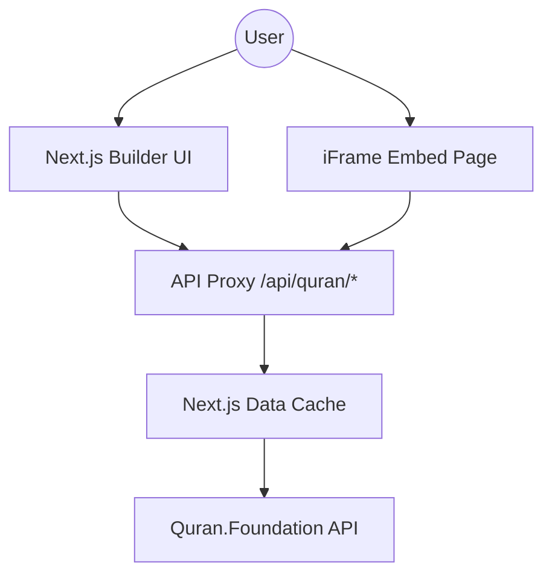

# System Architecture

Ayat Embed is a modern, high-performance web application designed to generate beautiful, embeddable Quranic verses.

## System Overview
The application consists of a builder interface (Next.js App Router) and an embed system that serves content via iFrames or static HTML.

## Core Components

### 1. API Proxy-Layer
Located at `src/app/api/quran/[...path]/route.ts`.
-   **Security**: Implements a strict path whitelist (`chapters`, `verses/by_key/`, `verses/by_chapter/`).
-   **Authentication**: Handles OAuth2 Client Credentials flow with Quran.Foundation.
-   **Caching**: Server-side caching for 1 hour (`revalidate: 3600`) to optimize performance and reduce upstream load.

### 2. Embed Protocol
-   **Communication**: Uses `postMessage` for iFrame-to-Parent communication.
-   **Auto-Resize**: The embed reports its height to the parent window for seamless integration.

### 3. Font Loading Strategy
-   Uses Google Fonts (Inter, IBM Plex Sans Arabic, Amiri Quran) for UI and text.
-   Loads specialized QPC V2 fonts dynamically for precise Quranic glyph rendering.

## Security Considerations
-   **Credentials**: Managed via environment variables (`QF_CLIENT_ID`, `QF_CLIENT_SECRET`). No hardcoded fallbacks in source code.
-   **Input Sanitization**: Client-side regex checks for malicious content in rendered strings.
-   **API Restrictions**: Whitelist strictly limits accessible upstream endpoints.
